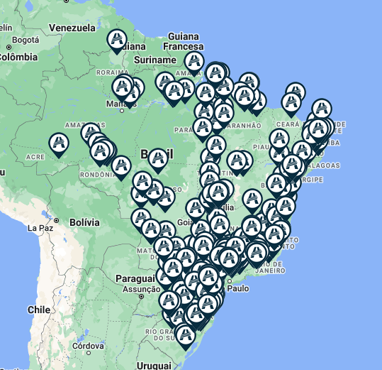

# Prim Adventista 🌎

##

### Web App que utiliza o Algoritmo Prim para resultar no caminho de menor custo possívelque conecta todas as unidades de uma mesma rede de ensino espalhadas pelo Brasil.

👈

## Como executar localmente 💻

1. Clone o repositório
2. Siga as instruções:

    ```
    # instale as dependências
    pip install -r requirements.txt

    # Execute o prim-web-app.py
    streamlit run prim-web-app.py
    ```
3. Abra no seu browser [localhost:8501](http://localhost:8501)

## Metodologia Aplicada 👣:

1. Coleta: Os dados dos colégios foram extraídos através de Web Scrapping da sessão de unidades do Colégio Adventista [LINK](https://www.encontreumaescola.com.br/mapa).

    
2. Tratamento de Dados: 
    1. Uitilizamos [pandas](https://pandas.pydata.org) para selecionar as 342 escolas com dados de localização Latitude/Longitude. 
    2. Utilizamos [geopy](https://geopy.readthedocs.io/en/stable/) para extrair a distância entre as escolas, utilizando 2 regras de negócio:
        1. Escolas se conectam com outras em um raio de até 100km de distância.
        2. Escolas isoladas, se conectam com a única escola mais próxima independente da distância.
3. Disponibilidade: Utilizamos 2 ferramentas principais para o desenvolvimento de uma interface visual interativa:
    1. [NetworkX](https://networkx.org/) foi utilizado para a criação de grafos, demonstrando o *Grafo Original* e a *Árvore Geradora Mínima*, proveniente do algoritmo Prim.
    1. [Streamlit](https://streamlit.io/) foi utilizado para fornecer um web-app para que o usuário possa inserir uma base de dados, escolher o vértice raíz, rodar o algoritmo e visualizar a lista de predecessores, lita de custos e os grafos.
3. Utilidade: Utilizamos as informações coletadas e devidamente tratadas como base de dados para validar o algoritmo Prim, cuja finalidade é encontrar o caminho de menor custo possível que conecta todas as escolas com fibra óptica. 

# 

## Autores 👥

| <a href="https://github.com/ericxlima"></a> | <a href="https://github.com/Victor-Amarante/"></a> |
| :----: | :----: |
| [Eric de Lima](https://github.com/ericxlima) | [Victor Amarante](https://github.com/Victor-Amarante/) |